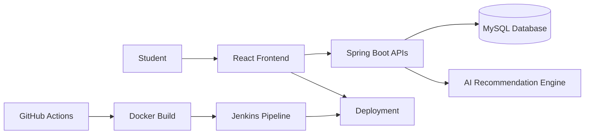
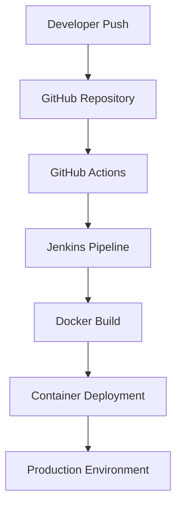

# <div align="center">


[](https://git.io/typing-svg)

<br>

[](https://edumind-six.vercel.app/)
[]()
[]()
[]()
[]()
[]()

<br>

### 🎓 Empowering Students Through AI-Driven Education

</div>

---

# 🌟 Overview

**EduMind** is a next-generation AI-powered educational platform designed to enhance learning experiences through intelligent recommendations, personalized study assistance, and interactive educational resources.

The platform combines a modern React frontend with a scalable Spring Boot backend to deliver a fast, secure, and responsive learning environment.

---

# ✨ Key Features

## 👨‍🎓 Student Experience

| Feature                  | Description                      |
| ------------------------ | -------------------------------- |
| 🔐 Secure Authentication | JWT-based login and registration |
| 📊 Dashboard             | Personalized student dashboard   |
| 📚 Learning Modules      | Interactive educational content  |
| 🎯 Progress Tracking     | Monitor learning journey         |
| 📱 Responsive Design     | Works across all devices         |
| ⚡ Fast Performance       | Optimized user experience        |

---

## 🤖 AI-Powered Learning

* 🧠 Intelligent Study Assistance
* 🎯 Personalized Learning Support
* 📈 Smart Progress Recommendations
* 📚 AI-Based Content Suggestions
* 🔍 Adaptive Learning Experience

---

## 🔒 Security & Reliability

* JWT Authentication
* Protected Routes
* Secure REST APIs
* Input Validation
* Database Integrity
* Role-Based Access Control

---

# 🏗️ System Architecture



---

# 🛠️ Technology Stack

## Frontend

```yaml
React.js
JavaScript
HTML5
CSS3
Bootstrap
Axios
```

## Backend

```yaml
Spring Boot
Java
REST APIs
Spring Security
Maven
```

## Database

```yaml
MySQL
JPA / Hibernate
```

## DevOps & Deployment

```yaml
Docker
Docker Compose
GitHub Actions
Jenkins
Vercel
```

---

# 🚀 Live Demo

<div align="center">

### 🌐 Experience EduMind Live

### https://edumind-six.vercel.app/

</div>

---

# 📂 Project Structure

```bash
EduMind/
│
├── backend/
│   ├── controllers/
│   ├── services/
│   ├── repositories/
│   ├── entities/
│   └── security/
│
├── frontend/
│   ├── src/
│   │   ├── components/
│   │   ├── pages/
│   │   ├── services/
│   │   └── assets/
│
├── docker/
├── .github/workflows/
├── Jenkinsfile
├── docker-compose.yml
├── README.md
└── LICENSE
```

---

# ⚙️ Local Installation

## 1️⃣ Clone Repository

```bash
git clone https://github.com/adityaraj1001/Edumind.git

cd Edumind
```

---

## 2️⃣ Frontend Setup

```bash
cd frontend

npm install

npm start
```

Application runs at:

```bash
http://localhost:3000
```

---

## 3️⃣ Backend Setup

```bash
cd backend

mvn clean install

mvn spring-boot:run
```

Application runs at:

```bash
http://localhost:8080
```

---

# 🐳 Docker Deployment

## Build Containers

```bash
docker-compose up --build
```

## Stop Containers

```bash
docker-compose down
```

---

# 🔄 CI/CD Pipeline



---

# 📊 Project Highlights

<div align="center">

| Metric         | Value                      |
| -------------- | -------------------------- |
| Frontend       | React 18                   |
| Backend        | Spring Boot 3              |
| Database       | MySQL                      |
| DevOps         | Docker + Jenkins           |
| Deployment     | Vercel                     |
| Authentication | Secure Login               |
| Architecture   | RESTful Microservice Ready |

</div>

---

# 📸 Screenshots

## 🏠 Home Page

```text
screenshots/home.png
```

## 📊 Dashboard

```text
screenshots/dashboard.png
```

## 🔐 Login Page

```text
screenshots/login.png
```

---

# 🎯 Roadmap

### Upcoming Features

* 🤖 AI Chatbot Assistant
* 📚 Personalized Learning Paths
* 📝 Online Assessments
* 🎥 Video Learning Platform
* 🔔 Real-Time Notifications
* 📈 Advanced Student Analytics
* ☁️ Cloud-Native Deployment
* 🌍 Multi-Language Support

---

# 📈 GitHub Stats Section

Add these badges below your repository:

```md


```

---

# 👨‍💻 Developer

<div align="center">

## Aditya Raj

🎓 B.Tech Computer Science & Engineering

💻 Full Stack Developer | DevOps Enthusiast

### Connect With Me

[](https://github.com/adityaraj1001)

</div>

---

# ⭐ Support The Project

If you found this project useful:

⭐ Star this Repository

🍴 Fork this Repository

📢 Share with Others

💡 Contribute New Features

---

<div align="center">

### 🚀 EduMind — Smart Learning for the Future


Made with ❤️ by Aditya Raj

</div>
